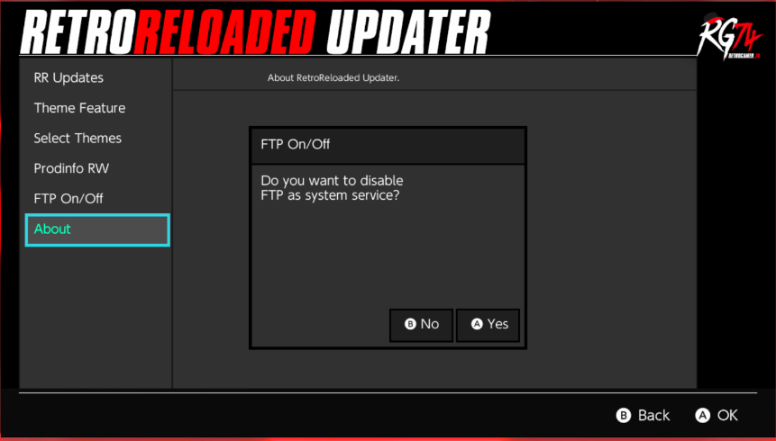

# RetroReloaded ToolKit

Just copy the last release of RetroReloaded Updater NRO file into your microSD switch folder.

Open your album, and open RetroReloaded Updater.

Features:
Fix Themes crashes when access to the Switch Settings menu just launching RetroReloaded Updater.
Enable/Disable Themes capabilities.
Allow to choose Themes between the ones suggested.
Allow to update RetroReloaded CFW Package.

# CREDITS

Inspired and forked from Reinx Toolkit

[You can get it here](https://github.com/Reisyukaku/ReiNXToolkit)

Thank you.
